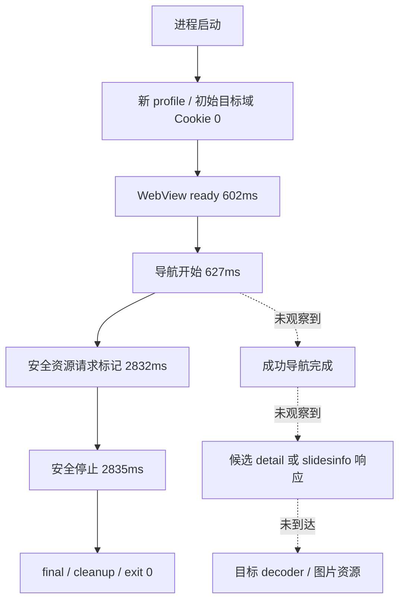

# 第二阶段 Browser Observation 可行性研究（2026-09-27）

## 最新收口：Browser停止，替代路线结果C（2026-09-27）

Browser Observation = **STOPPED / NOT VIABLE FOR v0.4.0**，触发本轮硬结束条件D：缺少证据证明剩余候选具备明显信息增益。上一轮JSON原文及DOM未保存，不能声称重新解码或证明页面无数据；helper对象根限制已静态确认，实际ERROR原因仍未确认。本轮Browser导航0，不改helper或production。

替代路线四个受控匿名GET：备用feed200/5其他作品无目标；share/note200含ID但未解析目标图片对象；share/slides200无目标；旧iteminfo200空正文。无Cookie/Token/签名/代理/重放，无图片下载。**Douyin gallery production feasibility = BLOCKED**，结构/URL NOT VERIFIED，下载NOT TESTED，Level1H Human PASS保持。

结果C：已调查的合法入口均暂未得到可用结构；建议v0.4.0明确图文原图暂不支持，保留现有视频与Bilibili多资源/重试/恢复/History目标。元数据、缩略图同样未证明，不宣传已支持。下一轮唯一建议目标是确认降级范围与验收清单，不再回Browser，不自动进入第三阶段。

Windows Network BLOCKED/normal cleanup FAIL/recovery历史PASS；Android生命周期、离线安全停止、cleanup历史PASS，real bridge仅JSON链PASS、真实安全停止NOT TESTED/Network BLOCKED。本轮不重跑旧平台实验。双平台production门槛未达。

完整决策、路线表、真实响应摘要、证据限制和兼容性检查：`v0.4.0/research/poc/browser-closeout-route-decision.md`；网络摘要：`anonymous-route-closeout-network-results.jsonl`。以下旧“剩余Browser候选/继续真实导航”仅为历史记录，已被本节替代。暂停等待指令。

## 最新：接线通过后一次真实 bridge 复验，结论2（2026-09-27）

显式研究Debug激活/一次性run保护、operation全链校验及真实NAVIGATE/停止状态接线完成；导航前审查通过，同构建离线回归PASS1820ms。唯一真实样本7690029886242009957：operation/Worker START/navigation各1，init/ack/ready各1、request31、命名hydration0、JSON2、fetch response0、body2（仅JSON）、decoder2/no-match1/error1/success0。953ms navigationBoundary拒绝跟随并取消，1029ms自动cleanup PASS；未识别安全挑战，真实安全停止NOT TESTED。真实bridge PASS仅限JSON→decoder链，目标结构/URL NOT VERIFIED，下载NOT TESTED，Network/production BLOCKED，Human Level1H PASS保持。

停止后gate与bridge计数不增，本次profile/cache/metadata/marker清除、Worker退出。历史3cache/5metadata/cf两marker列表前后一致；一次性研究控制账本保留，非浏览器残留。实验后设备研究包恢复默认PUBLIC_PROBE_ENABLED=false、无INTERNET，正式应用未改。

完整审查和结果：`v0.4.0/research/poc/android-activation-audit.md`、`android-real-bridge-recheck.md`。未追加导航/扩大采集；候选价值需先重新评估，不能以本次窗口零命中断言页面无数据或双平台路线已到边界。Windows旧结论保持。本轮证据仍不足以满足附件任一 A–D 结束条件，继续停留第二阶段。暂停等待指令。

## 历史：真实 bridge 前置审查未通过，离线修复后暂停（2026-09-27）

按附件前置失败分支，本轮真实导航0次：真实入口仍禁用，旧real消费者不共享fixture遥测，fixture手动发送response不等于通用采集。已统一consumePageMessage、增加命名hydration/普通JSON script及页面既有同源fetch响应副本观察，不另发请求、不重放；INTERNET和targetUrl继续关闭。真实模式激活/Coordinator调度与遥测仍需下轮审查，不能仅加权限就访问。

最终研究APK两次离线PASS（831ms / 499ms），每次注入注册/init/ack/ready各1、hydration1、JSON1、response1、body3、decoder3/success3；停止后消费不增、单operation/START1，自动清理新增存储与marker，历史3cache/5metadata/cf两marker不动。仅同源fetch离线能力，不覆盖XHR/跨域/全部资源body。真实bridge与真实安全停止NOT TESTED、Network/production BLOCKED、目标结构/URL NOT VERIFIED、下载NOT TESTED、Human PASS，Windows结论均保持。

详细证据：`v0.4.0/research/poc/android-real-bridge-preflight.md`。剩余候选NOT TESTED：真实模式激活审查后单次最小真实Android bridge复验。本轮证据仍不足以满足附件任一 A–D 结束条件，继续停留第二阶段。已暂停，不自行访问真实目标或进入第三阶段。

## 历史：Android 离线重入与 bridge 收口（2026-09-27）

CoordinatorService 状态机在分配之前拒绝重复 trigger，Activity 重建只 attach，Worker 进程级拒绝重复初始化。最终研究 APK 连续两次单 operation PASS（451ms / 373ms），随后快速、运行中、清理中重复 trigger 拒绝3、Worker START1、final734ms；本次操作 profile/cache/metadata/marker/Worker 零残留。bridge 初始化/ack/ready各1、hydration1、JSON1、response1、body3、decoder3/成功3，安全停止后消费不增。均限离线虚拟 fixture，不证明真实目标结构。

旧 onCreate 无条件分配缺陷已确认并复现；上一轮具体外部重入事件及真实 hydration0 的确切原因仍 NOT VERIFIED。本轮三项精确归属失败原型显式清理与正常自动清理分开记录；历史3cache/5metadata/cf两marker未动。当前 APK 无 INTERNET，不接受真实 targetUrl。Windows结论保持，真实安全停止NOT TESTED、Network/production BLOCKED、结构/URL NOT VERIFIED、下载NOT TESTED、Human PASS保持。

完整证据：`v0.4.0/research/poc/android-reentry-bridge.md`。剩余候选 NOT TESTED：Android 单次最小真实目标 bridge 数据入口复验，下一轮须重新审查真实接线，本轮不执行。本轮证据仍不足以满足附件任一 A–D 结束条件，继续停留第二阶段。已暂停。

## 历史：Android 单次公开目标实验（2026-09-27）

一个share/note目标、一次真实navigation：未检测到安全条件，10秒预算结束后取消，真实安全停止NOT TESTED；请求观察51，navigation1，response/body/hydration/decoder0，取消后消费不增。主operation自动cleanup PASS，但同一次启动出现额外Coordinator operation，已初始化Worker内失败、留下两个marker，故本轮完整零残留FAIL。lifecycle A及离线安全停止的历史范围PASS保持；旧3cache/5空metadata不删除。结构/URL NOT VERIFIED、下载NOT TESTED、Network/production BLOCKED、Human PASS保持，Windows结论不变。

桥接是否实际运行、Coordinator重入原因NOT VERIFIED，不能宣布双平台共同达到Browser研究边界。剩余合法候选NOT TESTED：先离线验证重入/Worker复用保护和document-start桥接健康；本轮不再请求真实目标。[证据、命令与文件]( android-public-target.md )。

本轮证据仍不足以满足附件任一 A–D 结束条件，继续停留第二阶段。已暂停，不进入第三阶段。

## 历史：Android 离线安全停止闭环（2026-09-27）

PJZ110 连续两次 securityFixture operation PASS（328ms / 285ms）：页面已加载、活动清理被拒绝，安全事件与同步观察取消同毫秒；六类离线消费替身计数停止后不增、排队任务消费0，Worker退出后Coordinator自动删除精确profile/cache/metadata/marker。Android离线安全停止PASS仅限受控模型，真实检测器/响应/decoder尚未验证；lifecycle A保持限定PASS。原3个历史cache及5个空metadata目录未删除，研究App storage不为0。Windows各结论保持，Android Network/production BLOCKED，真实结构/URL NOT VERIFIED、下载NOT TESTED、Human PASS保持。剩余候选NOT TESTED：Android最小真实目标安全停止/数据入口实验，下一轮单独决定，本轮不运行。

详细证据、时间线、文件和命令：[本轮离线安全停止记录](android-offline-security-stop.md)。本轮证据仍不足以满足附件任一 A–D 结束条件，继续停留第二阶段。暂停，不进入真实网络、production或第三阶段。

## 历史：Android 独立 Worker 自动清理闭环（2026-09-27）

本节为当前结果；后文是历史记录。使用 i-have-adhd Skill 将本轮分成构建、两次离线 operation、存储核查、收口；AGENTS.md 优先。Windows 完全冻结，未请求真实平台。Human Level 1H PASS 保持。

### 架构与归属

独立 Debug 包 com.mediaflow.research.v040.lifecycle（API29+ / target36，无 INTERNET），CoordinatorActivity 不初始化 WebView；私有 Service 位于 :offline_worker。每轮新 UUID operation 和 nonce，双份私有 registration/worker marker 校验，worker PID 与 /proc/stat 创建 ticks 一并验证，不能仅凭 PID 清理。

Worker 在 provider 初始化前使用 setDataDirectorySuffix，加载离线 HTML，等 Coordinator 实际触发 active cleanup guard 后才关闭。仅终止本独立 Worker 唯一 WebView 的 renderer；等待 onRenderProcessGone，destroy WebView，写 completion，发送 IPC，stopSelf / System.exit(0)。这是显式研究进程正常退出协议，不是人工 force-stop，不等于完整 Android production 生命周期。[renderer API](https://developer.android.com/reference/android/webkit/WebViewRenderProcess)说明 terminate 返回值本身不证明退出，故等待 [onRenderProcessGone](https://developer.android.com/reference/android/webkit/WebViewClient)。

Coordinator 收到 completion、Binder death，并确认 OS /proc/<pid> 不存在后，才验证归属和清理；50ms bounded polling 检查 OS 状态，不以固定睡眠假定死亡。活动 PID 的创建 ticks 相符时返回 ACTIVE_REFUSED、保留 profile；不符则 fail closed。无 completion、身份/路径错误、符号链接、越界、timeout 均不删除。固定研究 APK sandbox 中只处理本 operation 的 app_webview_mf040_<op>、cache/webview_mf040_<op>、no_backup/.webview_mf040_<op> 和两个 marker；验证每个树的 canonical 边界/lstat，再精确删除。不清空 root，不读正式应用目录。

### 实测及纠错

初始 prototype 自动退出成功934ms，但未完整持久化时间线。下一版两轮749/351ms的 JSON 自报 PASS **不能作为完整 cleanup PASS**：真实 cache 路径小写 webview，实现曾用大写 WebView，遗留缓存；修正后627/352ms两轮仍遗留专属 no_backup 空目录，也不能作为最终闭环证据。所有研究证据保留，不能把早期程序自报 PASS 当作最终验收。

最终代码连续两次独立 operation：

| 事件（ms，从 Coordinator 登记开始） | operation 1 | operation 2 |
| --- | ---: | ---: |
| Worker start | 200 | 134 |
| profile allocate | 397 | 230 |
| offline loaded | 468 | 312 |
| active cleanup 被拒绝，profile 保留 | 470 | 313 |
| renderer terminate requested | 472 | 313 |
| rendererGone / WebView destroy | 506 / 506 | 332 / 332 |
| completion received | 509 | 337 |
| Binder death / OS exit confirmed | 537 / 537 | 360 / 360 |
| ownership validated | 542 | 362 |
| profile/cache/metadata deleted | 544 | 363 |
| markers deleted / final | 544 / 544 | 363 / 363 |

op1=38171ce885a1477bace591a572891438，PID6066/ticks18278638；op2=63e7eca43c1b4d348934b27d124a066e，PID6602/ticks18279809。两轮均真实加载页面、自动退出/清理、activeProtection=true，无人工 stop 或下次启动 recovery。rendererGone 证明本次 renderer 退出；非所有系统 WebView 进程均清零。最终 pidof worker 无输出，两个 operation profile/cache/metadata=0，私有 worker_operations marker/registration=0。证据 android-worker-final-operation-{1,2}.json、android-worker-storage-inspection.txt、android-worker-coordinator.log。

### Storage 口径与限制

**Android lifecycle A PASS 仅限最终代码两次正常离线 worker/coordinator operation 与活动保护。** 不等于整个 App storage 为0，不等于历史失败 operation 已清理，更不等于 production feasibility。

旧版三次 operation cache、五个空 no_backup operation 目录仍存在；原 marker 已删，不能靠目录名字猜测删除，故保留。其三个 cache 内有 HTTP Code Cache/index，虽然本轮完全离线仍是浏览器运行时数据，不能描述为纯 APK 基础文件。研究 sandbox 全局残留清理仍 BLOCKED，不允许用本次精确清理成功宣称跨历史会话全清理。上轮默认 app_webview/cache/WebView/no_backup/.webview 也保留；shared_prefs 的 WebViewChromiumPrefs 仅检查键名 CachedFlagsEnabled/CachedFlagsDisabled/lastVersionCodeUsed，未导出值、Cookie 或 Token；这些 provider 共享元数据与 operation 三目录分开，跨版本/其他 provider 会话存储覆盖 NOT VERIFIED。

未测试异常 Worker 退出、Coordinator 死亡、真实 PID 重用、并发 Worker、provider升级等；normalCompletion 强制条件使异常退出不被当成正常 PASS。本轮不实现异常 recovery 或补清历史失去 marker 的目录，不扩大删除范围。关口 B 安全停止 NOT TESTED，C真实目标 NOT TESTED；本轮禁止网络，研究APK无 INTERNET。

### 状态及第二阶段判断

| 项目 | 状态 |
| --- | --- |
| Windows Network Observation | BLOCKED；完整窗口 NOT VERIFIED |
| Windows normal cleanup | FAIL；原真实失败根因 NOT VERIFIED |
| Windows recovery | PASS，限历史已测研究范围 |
| Windows Browser Observation route | BLOCKED |
| Android device/runtime | PASS，PJZ110/API37/WebView151离线实测 |
| Android worker lifecycle | PASS，最终两个正常独立 operation |
| Android active-worker protection | PASS，两次实际 cleanup guard 拒绝活动实例 |
| Android automatic profile cleanup | PASS，最终 operation profile/cache/metadata/marker 精确清理；历史残留清理 BLOCKED |
| Android lifecycle A | PASS，限上述独立 Worker/Coordinator 正常离线模型 |
| Android 安全停止 | NOT TESTED |
| Android Network Observation | BLOCKED，关口B尚未验证 |
| 目标图文结构 | NOT VERIFIED |
| 图片 URL | NOT VERIFIED |
| 图片下载 | NOT TESTED |
| production feasibility | BLOCKED |
| 剩余合法高价值候选 | NOT TESTED，独立模型离线安全停止夹具；历史失去marker残留的归属恢复方案需另评估 |
| 第二阶段附件结束条件 | NOT VERIFIED |

本轮证据仍不足以满足附件任一 A–D 结束条件，继续停留第二阶段。暂停，不进入第三阶段。离线正常清理模型解决当前两个 operation 闭环；正式数据入口、真实安全停止、production生命周期均未验证，不自动恢复真实目标实验。

### 验证、安装安全、文件范围

adb devices -l 确认40fcb99f/PJZ110。正式 com.mediaflow.mediaflow v0.3.0 与研究 Debug 包共存，签名不同但 applicationId 不同。研究更新前 apksigner 核验 SHA256 4f6a5194614d0f53c35add86eff6475b1cbc59a2376482d8afc1e08a423299c8 与已有研究包一致，aapt 核验包名/无INTERNET。仅 adb install --user 0 -r 更新研究包，未覆盖/停止/卸载/清除正式包、未 pm clear，正式 APK path 前后相同。研究包保留安装。

实际命令：已有 Gradle9.1.0/JDK17/ANDROID_HOME/GRADLE_USER_HOME，-p v0.4.0/research/poc/android-lifecycle --offline --console=plain assembleDebug lintDebug；apksigner verify --print-certs；aapt dump badging；adb -s 40fcb99f install --user 0 -r <独立研究APK>；am start -W -n com.mediaflow.research.v040.lifecycle/.CoordinatorActivity；run-as 本研究包 cat files/coordinator-result.json 和 ls -laR/ls -la 目录；pidof :offline_worker；pm path 正式包（只读）；logcat 仅 MF040Coordinator/MF040Worker 标签。Gradle 沙箱 DLL 加载失败后获执行批准使用同一离线工具链，最终 assembleDebug/lintDebug成功，lint 0 errors / 10 warnings（旧ProfileStore特性检查、缓存版本、backup/icon、API检查冗余），不是无警告。

dart analyze v0.4.0/research/poc/browser_observation_probe.dart：No issues found。无 Dart 改动，不运行 dart format。git diff --check通过（v0.4.0全未跟踪，另核查新增文本空白）；git diff --stat为空，不代表未跟踪无变更。未运行 flutter analyze/test、Windows/正式Android Release build、正式验收、安全停止、真实目标、图片下载、异常Worker测试。

修改 android-lifecycle/build.gradle（研究minSdk29）、src/main/AndroidManifest.xml、android README及v0.4.0 README/research README/stage2/feasibility/RC；新增 CoordinatorActivity.java、OfflineWorkerService.java、OperationFiles.java、6个operation JSON、storage inspection、coordinator log。无删除。仅使用现有SDK和AndroidX，不复制第三方代码，无新增生产依赖。只参考上面Android官方API。

【项目目标兼容性检查】Android已实际测试仅独立研究APK/API37离线模型，provider特定storage路径风险；Windows本轮未测且原cleanup FAIL保持；iOS/macOS/Linux理论上可做独立Adapter但本轮未实现/未测，不声称已支持该模型。Bilibili/Douyin正式Parser、未来Xiaohongshu/YouTube/X/Instagram、PlatformDetector、MediaContent/MediaResource、Downloader/Media Processing、ParserService、UI、History/Settings/Logging/本地存储均未修改/本轮未回归；研究Service不构成production Browser Adapter。正式安装包依赖/体积未变；研究每次新进程与provider缓存开销仅记录实测耗时，性能/跨provider维护风险未验证。隐私/零服务器保持，无账号凭据或网络。正式发布门槛未满足。

Git cwd/top-level D:\projects\mediaflow-v040；branch feature/v0.4.0；HEAD e2ea89d4e156c843af09b4c491984a2206f1135b；status ?? v0.4.0/。无Git写操作、production修改或Windows研究实现修改。

## 最新：Android 真机 gate A / Windows cleanup 定位（2026-09-27）

本节为当前判定；后文保留历史证据。Windows 不再请求 Douyin、不搜索新 Browser Observation 入口，不扩展 recovery。Level 1H Human PASS 不变，真实目标结构/URL NOT VERIFIED、下载 NOT TESTED。

### Android 安装安全与环境

40fcb99f PJZ110 状态 device，Android 17 / API37、arm64-v8a；provider com.google.android.webview 151.0.7922.199。用户 0。正式 com.mediaflow.mediaflow v0.3.0 已安装，targetSdk36，签名指纹 16686BCE55B6C8EB66BB16B77A8599FA6005483E97430C519710A4D730C6DCBA。新研究包 com.mediaflow.research.v040.lifecycle 原本不存在，APK 包名和权限经 aapt 核验，Debug、无 INTERNET 权限；签名 SHA256 4f6a5194614d0f53c35add86eff6475b1cbc59a2376482d8afc1e08a423299c8。包名不同、签名不同，不需要与正式包签名兼容，不发生覆盖。

首次 adb install --user 0 不带 -r；后续仅同签名研究包 -r 更新，事前核验签名不变。只 force-stop 本轮研究包确认进程退出；未停止、覆盖、卸载或清除正式应用，也未调用 pm clear / adb uninstall。最终两个包共存，研究包保留安装。正式 APK path 前后相同；未读取正式用户数据。

### Android gate A 真实离线证据

独立 Java PoC 复用现有 AndroidX WebKit 1.15.0，随机 named profile、无网络离线 HTML。MULTI_PROFILE 可用；profileAssigned 299ms → offlinePageFinished 493ms → viewDestroyed 795ms → deleteProfile 1095ms 抛 java.lang.IllegalStateException，profilePresent=true、profileCleaned=false。result.json 为可观察 final equivalent。源自本次原生独立 APK，不是模拟 Android PASS。

这是加载 profile 后原进程 deleteProfile 的真实阻塞，与旧 Android host 的 destroy/deleteProfile 问题一致；新 provider 没有解除它。**gate A lifecycle BLOCKED**，因此 gate B 安全停止 / gate C 真实平台观察均未执行，不能谈论 Android 目标页面有没有结构。

仅为清理本次自己的无网络 profile，补充 cleanupOnly 入口读取本包私有精确 marker。研究进程停止后新 PID14318 独立启动，ownedStartupCleanup 5ms → profileDeletionReturned 88ms，profileCleaned=true、profilePresent=false，marker 消失。不是原进程正常 cleanup 成功，不能覆盖 gate A。getAllProfileNames 与 deleteProfile 成功确认逻辑 profile 删除；本包 app_webview 仍有 Default、pref_store 等运行时文件，不能声称全部浏览器存储为空或 production 完整清理闭环成立。无凭据、真实页面或图片请求，未读出 Cookie/Token 值。

### Windows cleanup 定位

finish_navigationRejected 与其他 outcome 共用 Finish，没有单独跳过 dispose 的分支。现有顺序是标记 finished/停 timer/取消读取 → Cookie 数量诊断 → view.Dispose → 10次300ms目录删除 → final；异常原先被吞掉，上一轮没有删除错误类型/HResult 或 browser exit 时刻，无法反推唯一根因。final 在删除尝试之后发出，但并没有强制等待 BrowserProcessExited，故不能据 Dispose 返回推断进程均退出。

本轮只增强研究诊断：viewDisposeStarting/Returned、BrowserProcessExited、删除失败的类型/HResult/次数、cleanupComplete、finalSending。没有改变观察安全停止或盲目增加 timeout。新增 rejectFixture 用离线 NavigateToString 加 meta refresh 到 localhost，下一导航在请求执行前取消，无目标平台请求。第一次夹具拒绝了初始导航，不计完整等价路径；修正为仅允许初始离线导航后，得到以下真实时序：

701ms ready → 718ms 初始导航 → 793ms 离线 navigationCompleted → 809ms 第二导航 → 813ms finish_navigationRejected → 816ms dispose开始 → 911ms dispose返回 → 1229ms browserProcessExited → 1296ms cleanupComplete/finalSending。profileCleaned=true、final收到、helper exit0、目录不存在、profile根0、marker0；完全自动，无事后 recovery。这个受控场景 PASS，但没有稳定复现原真实 share FAIL；不能证明修复了原问题，**Windows normal cleanup 继续 FAIL**。

根因 NOT VERIFIED。当前假设是部分导航取消后的 browser/storage 释放延迟或文件句柄占用超过3秒重试预算；本轮未取得原失败 exception/HResult，不能把假设写成事实。也未证明单纯 navigationRejected 分支必然失败；受控反例表明它本身可以正常清理。没有重新访问 share/note、没有修改 timeout/recovery、没有 production 修复。

### 当前独立状态

| 项目 | 状态 |
| --- | --- |
| Windows Network Observation | BLOCKED，完整窗口 NOT VERIFIED |
| Windows normal cleanup | FAIL，原真实失败原因未确认；本轮受控 rejection cleanup PASS 不覆盖 |
| Windows recovery | PASS，限既有研究场景，本轮未扩展；完整生命周期 NOT VERIFIED |
| Windows Browser Observation route | BLOCKED，数据入口研究边界保持 |
| Android device/runtime | PASS，仅真实设备连接与离线原生 WebView 启动/退出 |
| Android lifecycle | BLOCKED，原进程 loaded profile 删除失败 |
| Android安全停止 | NOT TESTED，gate A 未通过 |
| Android Network Observation | BLOCKED，gate A 阻断；真实目标运行 NOT TESTED |
| 目标图文结构 | NOT VERIFIED |
| 图片 URL | NOT VERIFIED |
| 图片下载 | NOT TESTED |
| production feasibility | BLOCKED |
| 剩余合法高价值候选 | NOT TESTED，Android 独立 worker 退出后自动清理的离线闭环 |
| 第二阶段附件结束条件 | BLOCKED |

### 第二阶段路线判断

Android runtime 已有真实结论，不能再记“无设备/全部 runtime NOT TESTED”。当前原进程 MULTI_PROFILE 删除路线 lifecycle BLOCKED；Windows 数据路线已收口。尚有具体合法 lifecycle 候选：独立 worker 使用自己的 named profile，正常结束并退出进程；协调器确认该实例/PID创建信息及精确归属，再由未加载该 profile 的进程删除，检查存储与 marker。它可用离线页面验证，不接触真实目标/账号、不规避安全挑战；本次新进程删除成功是线索，但自动闭环、活动保护与安全停止尚未实现或验证。本轮不扩大到该新架构，也不能宣称 Android 所有 Browser Observation 架构均不可行。

因此“Windows 与 Android 路线均已达到边界且没有其他合法候选”的前提尚未成立。附件 A/B 要求目标结构/请求或下载，未取得；C 的延长观察未执行且不能违背即时停止；D 的整体 lifecycle 不可满足尚不能由一个架构的失败证明。**本轮证据仍不足以满足附件任一 A–D 结束条件，继续停留第二阶段。** 本轮完成后立即暂停。

### 验证、依赖与项目目标兼容性

实际执行：adb device/getprop/webviewupdate/包名和签名检查；研究 Android Gradle --offline assembleDebug（最终成功，前期未缓存的旧传递版本解析失败已记录）；aapt/apksigner；独立 Debug 安装/同签名研究更新；真机普通 LifecycleActivity 及新进程 cleanupOnly；run-as 仅本包 result/marker/目录名；Windows研究helper编译、rejectFixture；dart format/analyze研究runner（最终0 changed/No issues found）；Git与根目录检查。完整脱敏证据见 [本轮日志](android-lifecycle-windows-cleanup.log)。

新增独立研究工程的构建声明，仅复用已有 AGP/AndroidX WebKit/缓存传递库，无下载、无新生产依赖、无第三方源码复制。原项目API设计参考为本仓库 Apache-2.0 AndroidBrowserObservationHost；AndroidX Apache-2.0，既有 Microsoft WebView2 SDK 沿用，无新服务。未运行 gate B/C、目标网络、图片下载、Release build、正式验收或 Flutter全量回归。format 的未解析 flutter_lints include 警告不能写成完整 Flutter analyze PASS。

Windows 研究实际测试，normal cleanup 原失败仍有风险；Android 真机实际测试但 lifecycle BLOCKED；iOS/macOS/Linux 暂不支持这些原生研究工具、未构建未实测，仅 Adapter 理论路径。正式 Bilibili/Douyin、未来平台、PlatformDetector、ParserService、MediaContent/MediaResource、Downloader、Processor、UI、History、Settings、Logging/存储均未改且未重跑回归。研究仍本地/隐私/零服务器，APK无互联网权限，正式包体未改变；Android启动新进程与Windows异步释放是维护/性能风险。研究结果不构成正式发布或新平台支持。

## 最新：share/note 单次匿名实验（2026-09-27）

本节为当前状态，后文为历史证据。本轮只有一个真实目标样本、一次目标导航，无第二样本、无图片下载。目标 7690029886242009957 保持 Level 1H / Human PASS；Machine image / Structured data NOT VERIFIED。

### 事件与结果

原始入口：https://www.iesdouyin.com/share/note/7690029886242009957/ 。全新 InPrivate GUID profile，initialDirectoryAbsent=true，初始目标域 Cookie 数量 0，不导入用户登录状态。日志见 [单次运行](share-note-windows.log)。

| 相对 helper 启动时间 | 实际事件 |
| --- | --- |
| 640ms | webviewReady |
| 668ms | 首次 navigationStarting |
| 2870ms | 第二次 navigationStarting；重定向 www.douyin.com /note/<id>，blockedNote=true |
| 2875ms | finish_navigationRejected，取消继续导航 |
| 后续 | final 收到、helper exit 0；runner exit 1，因为自动清理未通过 |

重定向日志只保留 host 和归一化路径，不记录 query；跳转目标的精确作品 ID 未在该事件保留，不能追认精确匹配。阻止继续的条件是进入 /note 路线，无须目标 ID 才执行停止。本次未出现 navigationCompleted、DOMContentLoaded、hydrationRead、securityResourceDetected 或 decoder 调用。停止前 response=0、candidate=0、body bytes=0，仅关联创建=1；没有可消费目标结构。未进入已阻塞 /note 页面重试，没有在停止后读取 DOM/body。

**share/note 候选：BLOCKED（情况 C）。在本次允许观察窗口内未取得目标结构；安全停止之后的页面状态未验证。** 不是“页面不存在结构化数据”。

### Cleanup 新发现及处理

既有 normal cleanup PASS 保留为历史受控场景。此次 navigationRejected 正常退出路径自动 cleanup **FAIL**：final.profileCleaned=false、directoryRemaining=true；initialCookies=0、finalCookies=1 仅为数量，无 Cookie 值读取/导出记录。匿名浏览器状态曾随本研究 UDF 残留，不能声称一直没有持久残留。失败原因 **NOT VERIFIED**，不凭推测加大重试窗口。

事后关联 WebView2=0、helper 已 exit 0。依据本轮记录的精确 profile 路径验证绝对研究根、活动进程状态、根及全部后代无 reparse；目录共 76 项、只读项 0，仅 Remove-Item -LiteralPath 本轮目录 -Recurse -Force。没有清空根、猜测归属、制造 marker 或强杀用户进程。最终 profile 根 Count=0；本次未创建 recovery marker，无 marker 残留。事后清理 PASS 不覆盖自动 cleanup FAIL。未发生 hard-kill，也未扩展 recovery 研究。原先研究生命周期证据仍仅适用于已测场景；本次缺陷使它不能推广到所有退出场景。

### 研究实现与离线验证

仅 research helper 增加 share 模式：严格限定 HTTPS 443、无凭据/query/fragment、公开 share/note 路径，导航只接受原始目标 URL；任何其他顶层导航均拒绝，不放宽安全资源即时停止。固定只读脚本检查命名 hydration 与最多八个 JSON script，只投影精确字符串作品 ID、图文字段名和图片 URL 数组；递归/访问次数/资源与输出数量有界，不输出原始根、账号字段或 Cookie/Token。原始目标网页 HTML 未另外读取，不能把未取得说成已扫描全部 HTML。

DOMContentLoaded 和既有定时器触发读取，停止前后均检查状态，停止后禁止输出；命名脚本内部也先执行安全分类。研究 runner 日志仅保留字段/数量/类型，实际 URL 不落日志；share 模式禁图片下载。补充 CheckStop await 后 finished 防护，避免已结束会话的异步回调继续诊断。该修正只做离线验证，未重新访问目标；不声称它解决 cleanup 缺陷。

离线 shareFixture：模拟 JSON 精确 ID、aweme_type=68、两条不同模拟图片 URL，经研究 decoder 得到 2 项；shareStopFixture：相同 JSON 配安全验证文本，先停止，无 hydration 输出；两者 final/exit/自动 profile cleanup 通过。它们是模拟数据，不计真实目标结构、URL 或 Level 2。首次夹具 example.com 被既有 decoder 域名白名单拒绝，随后改为 fixture.douyinpic.com 字符串并重跑通过，完全未请求这些 URL。最终修正后夹具 hydration 811ms；安全夹具 domStop 836ms / finish 842ms。

### 独立状态

| 项目 | 最新判定 |
| --- | --- |
| Windows Network Observation | BLOCKED；完整观察窗口 NOT VERIFIED |
| Windows normal cleanup | FAIL，本次 share 重定向退出；此前受控场景 PASS 保持 |
| Windows hard-kill / recovery | PASS，限既有研究场景；完整生命周期 NOT VERIFIED，本轮未重跑 |
| share/note 候选 | BLOCKED |
| 目标结构 | NOT VERIFIED |
| 图片 URL | NOT VERIFIED |
| 图片下载 | NOT TESTED |
| Android runtime | NOT TESTED；adb 当前有 PJZ110 真机，不再记无设备 |
| production feasibility | BLOCKED |
| 新的合法高价值 Windows Browser Observation 路径 | BLOCKED；当前未发现具体剩余候选 |
| 第二阶段附件结束条件 | BLOCKED |

### 第二阶段路线判断

唯一尚未执行的 share/note 候选现已验证为重定向阻塞；不能通过继续已阻塞 /note、变更安全停止或增加轮询推进。**Windows Browser Observation 在当前项目安全约束下已到达本阶段研究边界。** 这不代表整个 v0.4.0 不可实现。Android 已有设备但仍需独立研究运行、安装安全及 profile 生命周期验证，不能类推 Windows；本轮不安装 APK，不转换任务。

已重新读取附件 A–D：A 要求目标结构与两图下载，B 要求目标相关结构/数据请求，两者未取得；C 要求延长 Observation/filter 实验，本轮未延长且不允许绕过安全停止；D 要求路线无法满足 lifecycle，单次自动清理失败而精确事后清理可完成，尚不能证明该绝对条件。**本轮证据仍不足以满足附件任一 A–D 结束条件，继续停留第二阶段。** 立即暂停，不进入第三阶段。

### 命令、边界与兼容性

实际：adb devices -l（40fcb99f device PJZ110）；browser/build.ps1；dart format 与 dart analyze browser_observation_probe.dart（最终 0 changed / No issues found）；runner shareFixture、shareStopFixture、share；精确残留进程/路径检查及清理；git diff --check、branch/HEAD/status、profile 根检查。初次非提升编译命令未及时返回且无输出，成功验证以显式 Dart 路径及允许执行环境为准。format 的 flutter_lints include 未解析提示不算 Flutter 全量检查。

未执行图片 GET、Android PoC/构建/安装、Flutter analyze/test、Release build、正式验收、新 recovery 场景。无第三方代码复制或新依赖。Windows 研究实测但数据链阻塞且本次 cleanup 失败；Android 有设备未实测、profile 风险保持；iOS/macOS/Linux 本研究工具暂不支持、未构建未实测。Bilibili/Douyin production、未来平台、Detector/ParserService、MediaContent/MediaResource、Downloader、Processor、UI、History、Settings、Logging/本地存储未改，也未重新回归；不能增添正式能力保证。临时研究资产不进生产包；本地/隐私/零服务器保持，匿名 UDF 清理缺陷与页面重定向是当前维护风险。

## 最新收口判断（2026-09-27）

本节覆盖后文历史状态。本轮仅源码审计和离线 recovery 测试，无目标网络请求。Level 1H / Human PASS 保持。

| 项目 | 判定 |
| --- | --- |
| Windows Network Observation | BLOCKED；已测 /note 安全停止，完整窗口 NOT VERIFIED |
| Windows normal cleanup | PASS，既有受控退出证据 |
| Windows hard-kill / recovery | PASS，限已测归属、活动保护、同 session 并发及实际 WebView2 强杀回收；完整生命周期 NOT VERIFIED |
| 目标结构 / 图片 URL | NOT VERIFIED |
| 图片下载 | NOT TESTED |
| Android runtime | NOT TESTED，adb 无设备 |
| production feasibility | BLOCKED |
| 尚未执行的合法高价值实验 | NOT TESTED，独立 share/note 入口 |
| 第二阶段结束条件 | BLOCKED |

### 停止前数据链审计

GalleryObservationHelper.cs 在 Navigate 前注册事件。response/body 回调不依赖 navigation complete；研究 Dart runner 收到 candidate 即调用 gallery.parseStructured，不等待导航完成。读取与发送前检查停止状态；停止后取消、释放流和清除待处理数据符合安全边界，不能事后恢复消费。

现有目标日志 acceptedCandidate/filterAccepted/bodyReadAttempts 均为 0，busySkipped、correlationEvicted、missingCorrelation 均为 0。一个 response 被路径过滤拒绝，body 未读，不能推断其内容。未发现已合法取得的目标 JSON 被遗漏、未消费或错误丢弃；无需修改 decoder、缓存或事件顺序。无目标 JSON 离线夹具，不构造结构验证 PASS。不能据此声称页面不存在结构化数据。

### Recovery 收口

test-recovery-boundaries.ps1 新增两个实际离线断言：独立 PowerShell 持有同一命名 mutex 时 RECOVERY_BUSY；保留观察句柄并强杀该持有者后，真实 abandoned mutex 可被接管，RECOVERED，仅回收已证明 stale 的精确 profile，活动夹具保留。九条断言 PASS，见 stage2-closeout-windows.log；最终 profile 根目录 Count=0。没有修改 recovery 实现或扩大删除范围。

证据足够支持当前受控研究 PoC 生命周期安全（单 helper 会话、精确归属、同 session recovery），不足以支持 production 完整生命周期。两个真实 WebView2 helper 同时 stale/active 本轮 NOT TESTED：现有 harness 为单 helper，多实例 IPC/退出协调不属于简单补测，本轮收口而不扩展。真实 PID 重用、断电、OS crash、跨 session、回收中途死亡仍 NOT TESTED；完整 marker 伪造防护 NOT VERIFIED。锁持有者退出不是系统崩溃模拟。

### 第二阶段路线判断：情形 1

仍有具体合法且尚未执行的候选：全新独立匿名研究 profile 直接打开 https://www.iesdouyin.com/share/note/7690029886242009957/ ，仅检查正常执行后、安全停止前的命名 hydration（_ROUTER_DATA、RENDER_DATA、__UNIVERSAL_DATA_FOR_REHYDRATION__），要求目标 ID 精确匹配及真实图片字段。此前该入口只有匿名原始 HTTP 路由壳证据；正常浏览器执行尚未验证，已测浏览器入口是 www.douyin.com/note。

下一轮仅作一次有限实验，研究入口限定精确 URL 与读取范围；出现安全验证或重定向到已阻塞 /note 即停止，不继续监听、补抓、重放或重试。读取须受停止状态取消，禁止停止后输出。这回答公开 share 入口自身正常执行是否提供目标 hydration；不是在已停止会话换 observer。无需 Cookie/Token 导出、账号、代理或 MITM，不放宽 AGENTS 第十/十五条。本轮只列候选，未实现或执行。

已测 /note route 仍 BLOCKED；当前 Browser Observation 路线不足以证明 production feasibility。不是目标页面无结构或整个版本不可实现的结论。Android 同等重要，无设备，runtime NOT TESTED、production BLOCKED。

**本轮证据仍不足以满足附件任一 A–D 结束条件，继续停留第二阶段。** 完成本轮后暂停。

### 验证及项目目标兼容性检查

实际执行 adb devices -l；test-recovery-boundaries.ps1（9 PASS）；browser/build.ps1（研究 helper 编译成功）；dart format browser_observation_probe.dart douyin_gallery_probe.dart（2 files，0 changed）；dart analyze 同两脚本（No issues found）；git diff --check；Git 与 profile 根检查。format 提示根 analysis_options 的 flutter_lints include 未解析，不冒充 Flutter 全量分析通过。未执行网络 PoC、Flutter analyze/test、Release build、Android build/真机或发布验收。

Windows 仅研究实测；Android 未实测且有 profile 风险；iOS/macOS/Linux 暂无本研究 runtime 实测。生产平台解析、未来平台、统一模型、Downloader、Processor、Browser Adapter、ParserService、UI、History、Settings、Logging、本地存储均未修改，也未重新回归，不新增生产能力保证。研究保持本地、隐私、零服务器，无第三方代码复用或新依赖，无包体变化；候选仍有页面变更、双平台生命周期及维护风险。

## 最新：recovery 生命周期边界测试（2026-09-27）

本节为当前状态，后文保留既有事件/硬杀证据。**本轮没有网络请求或目标页面导航，不改变 securityResourceDetected 的即时停止。** 已知目标事件仍为 602ms ready → 627ms navigationStarting → 2832ms securityResourceDetected → 安全停止/final/cleanup；不能推断页面不存在结构化数据。

### 最小研究改进

旧 v1 marker 写了 helperStarted 但未核验，字段检查不完整，并发 recovery 无互斥。新增 recover-owned-profile.ps1，由原 hardkill-recovery.ps1 的 -Recover 入口调用；不修改生产 adapter/helper。

v2 外层 marker 与 profile 内 .mediaflow-research-owner.json 同时记录 kind、绝对 profile、随机 runId/nonce、helperPid、UTC helperStarted。先校验全部字段及两份记录一致，再比较 PID + 创建时间；同一实例活动则 ACTIVE_SKIP，PID 存在但创建时间不匹配则 PID_REUSE_BLOCKED，均不删除。旧 v1、缺失/损坏/不匹配归属默认拒绝，不自动迁移或按目录名猜归属。

每个随机 profile 使用一个 Local 命名 mutex。精确 marker、限定研究根、无 reparse、helper 不活动、无关联 WebView2 都成立才删除这一个目录。并发实例忙则 RECOVERY_BUSY；另一实例已完成则 ALREADY_GONE，不进行第二次删除。没有根目录清空、用户 profile 扫描、对子进程的回收性强杀或新依赖。Local mutex 不证明跨 Windows 登录 session 的互斥。

### 实际离线证据

| 场景 | 结果 | 证据范围 |
| --- | --- | --- |
| stale marker，原 helper 已退出且 WebView2 已退出 | PASS | 本轮真实 WebView2 硬杀 + 下次独立启动 RECOVERED，目录/marker 消失 |
| 活动 helper / profile | PASS | 真实 WebView2 hardkill 测试 ACTIVE_SKIP；未删除活动目录 |
| 一个 stale、一个 active | PASS | 同时创建两个独立受控目录/进程夹具；仅 stale 删除，active 留存；不是双 WebView2 helper 并发运行 |
| 损坏 JSON | PASS | INVALID_MARKER，目录保留 |
| 缺失 helperStarted | PASS | INVALID_MARKER，目录保留；不是按文件名删除 |
| 外层 nonce 被篡改 | PASS | 与内部归属不一致，INVALID_MARKER，目录保留 |
| 同 PID、不同创建时间夹具 | PASS | PID_REUSE_BLOCKED，目录保留；只测分支，不冒充真实 OS PID 复用 |
| 两个 recovery 实例同时处理同一 stale | PASS | 两个独立 PowerShell 进程：RECOVERY_BUSY、RECOVERED；只有一个成功删除，active 目录仍在 |
| 最终 profile 根 / marker | PASS | Count=0，仅清理本次明确创建的测试目录和 marker |

七条自动化断言实际通过，脚本 test-recovery-boundaries.ps1；使用本轮新建无网络内容目录及自己的等待子进程。finally 中的夹具删除是测试收尾，不计为 recovery 成功：通过断言时已验证损坏 marker 所属目录仍存在。实际 WebView2 回归独立运行 hardkill-recovery.ps1，初始 Cookie=0、离线导航完成、ACTIVE_SKIP sameInstance=true；强杀 helper exit=-1、finalFrameReceived=false、目录残留、关联 WebView2=2；等待后关联数=0。在下次独立工具进程启动 -Recover，RECOVERED，最终根目录 Count=0。原始证据见 [本轮日志](recovery-boundaries-windows.log)。

### 未证明的边界

真实 OS PID 复用、双 WebView2 helper、多 profile 真正浏览器并发、helper 已死但 WebView2 长期不退出、父进程与 WebView2 同时死亡、系统断电/异常重启、跨 Windows session recovery、并发恶意 marker 写入：**NOT TESTED**。已退出 helper 而 WebView2 仍活动的保护代码存在，但本轮未在该短暂窗口调用 recovery，不能记新 PASS。

两份归属记录与随机 nonce 防止单份误改/缺失造成删除，**不是本地恶意进程身份认证**。同权限进程若能伪造两份一致记录，当前机制不能证明可信原始创建者；完整 marker 伪造防护 **NOT VERIFIED**，不扩展为 production 认证机制。并发测试只覆盖同一 Windows session、固定两实例、本次受控 stale；没有证明所有并发和崩溃交错。

### 当前八项状态

| 项目 | 状态 |
| --- | --- |
| Windows Network Observation | BLOCKED（既有安全验证）；完整观察窗口 NOT VERIFIED |
| Windows normal cleanup | PASS（既有实际证据，当前 helper 清理逻辑未改） |
| Windows hard-kill / recovery lifecycle | PASS（本次离线 v2 marker、字段拒绝、活动保护、单 session 两 recovery）；完整生产生命周期 NOT VERIFIED |
| 目标图文结构 | NOT VERIFIED |
| 图片 URL | NOT VERIFIED |
| 图片下载 | NOT TESTED |
| Android runtime | NOT TESTED（本轮 adb devices -l 无设备） |
| production feasibility | BLOCKED（目标数据/Android/完整生命周期门槛未成立） |

Level 1H / Human PASS 不变。**本轮证据仍不足以满足附件任一 A–D 结束条件，继续停留第二阶段。** 完成后暂停，不进入第三阶段。

### 命令 / 检查 / 兼容性

实际执行：
- browser/test-recovery-boundaries.ps1：七条断言 PASS；
- browser/hardkill-recovery.ps1；下一独立启动 -Recover 本轮 marker：PASS；
- browser/build.ps1：最小 helper 编译通过；
- dart format browser_observation_probe.dart douyin_gallery_probe.dart：2 files，1 changed（格式变化）；提示根 flutter_lints include 未解析，不算 Flutter analyze；
- dart analyze 两研究文件：No issues found；
- git diff --check：exit 0，但当前研究文件未跟踪，不覆盖它们的 patch 检查；
- profile 根目录检查：Count 0；git 状态 ?? v0.4.0/，feature/v0.4.0，e2ea89d。

未运行 Flutter analyze/test、Release build、双平台正式验收。没有 production 变更、依赖安装、第三方源码复用或 Git 写操作。Windows 研究新增实测；Android BLOCKED/NOT TESTED；iOS/macOS/Linux 本研究工具暂不支持、未构建未实测。正式平台 Parser/Adapter、统一模型、Downloader/History/UI/Settings/Logging/本地存储未改，未重跑旧功能回归；未来平台和 Media Processing 未新增实现。隐私、本地与零服务器保持；研究文件不会进现有生产包，维护风险是归属真实性与未覆盖的并发/崩溃交错。

---

## 本轮：事件定位与硬杀回收（2026-09-27）

本节取代下文“硬杀未测试”的历史状态。完整脱敏证据见 [事件与硬杀日志](browser-events-hardkill-windows.log)。

### 规则冲突与生命周期决定

AGENTS.md 第十/十五条要求遇安全验证即停止。用户提出在 browserVerification 后继续短期观察，与该规则冲突；browserVerification 是检测到验证，不是验证成功。保留即时安全停止，不关闭检测，不等待 challenge 执行，不求解、不重放。仅补充有界事件诊断，并做一次新的保留停止条件的目标会话，未重复旧 HTTP 探针。本轮**没有**执行“安全验证后延长 Observation”的实验。

### 上轮与本轮实际事件

上轮日志：profile ready、初始 Cookie=0、最终 navigationSucceeded=false、responses=1、candidates/calls/bytes=0、browserVerification、cleanup=true。没有事件序号/停止来源，不能回填上轮具体触发路径或时间，也不能证明所有 JS 未执行。

本轮单次目标诊断：WebView ready 602ms → navigationStarting 627ms → securityResourceDetected 2832ms → finish_browserVerification 2835ms → final → 删除 profile → process exit 0。**未出现 navigationCompleted 事件**。securityResourceDetected 对应 WebResourceRequested 中已存在的 waf-jschallenge/lf-waf-js 路径标记；不记录完整 URL/query。不是 DOM 判断触发、不是 decoder rejected、不是“验证完成后成功退出”。探针看到安全资源请求并停止，不证明该资源执行了什么、哪段客户端 JS 已运行。

存在 1 个被拒绝路径的响应、2 次关联创建；detail/slidesinfo 候选 0、JSON body read 0、decoder 0。目标数据请求是否可能在完成加载后出现仍未知。**不能将安全终止前无候选误写为页面没有结构化数据**。

### 实际 filter 与摘要边界

| 项目 | 当前代码 |
| --- | --- |
| body host | www.douyin.com；HTTPS 443，无 userInfo |
| body path | /aweme/v1/web/aweme/detail/；/aweme/v1/web/aweme/slidesinfo/，StartsWith 前缀匹配 |
| query | 不参与 body 路由匹配；不保存或输出；摘要仅输出 URL 是否包含目标 ID 的布尔值 |
| method | 不作为现有接受条件；摘要记录 method |
| resource type / status / MIME | xhr 或 fetch；2xx；application/json 或 application/*+json |
| note/aweme detail 其他入口 | 精确真实 endpoint 未确认，不扩大 body allowlist；note 页面不是 JSON endpoint |
| image_post_info / aweme_detail / images | JSON 字段，不是 URL filter；研究 gallery 脚本有精确 aweme_id/item_id 检查、图片数组按位置读取 |

slidesinfo 已修正为带第二段 aweme 的路径；本轮目标诊断使用正确 body filter，但在候选出现前安全停止，仍不能称为 slidesinfo 平台成功验证。

新增有限 requestSummary：只允许 www/m.douyin.com、www/m.iesdouyin.com，并将候选路径限制为 /aweme/v1/(web/)?(aweme/)?(detail|slidesinfo|note)/?，最多 16 条。其“note”变体仅为诊断猜测，非已确认入口。扩展摘要不扩展 body 读取；不记录无关第三方、query 值、header、Cookie/Authorization 或完整响应。本轮目标会话发生在摘要变体范围扩大之前（detail/slidesinfo 已正确），候选摘要仍为 0；最终扩大摘要代码只完成离线运行，**未再请求目标页面**。

目标 aweme_id/aweme_type/aweme_detail/image_post_info/images/slides/图片数量仍未取得。没有“含目标 ID 的 JSON 被视频 decoder 拒绝”的证据，故不继续扩展 decoder。两图下载、hash、MIME、magic、字节数与重定向均 NOT TESTED。Level 1H/Human PASS 保持。

### 硬杀与下一次启动回收

新增 browser/hardkill-recovery.ps1：仅离线静态页面，无平台请求。marker 位于自己的 build/gallery_observation_research/profiles 根，文件名与随机 profile GUID 一致，记录 MediaFlow research 类型、绝对目录、helper PID/start time。回收仅接受精确 marker，不扫描用户 profile；核对研究根、目录名、归属标记、根/子目录无 reparse；helper PID 存在或同目录 WebView2 存在时拒绝删除。PID 复用时保守拒绝，不能证明进程身份就不清理。

实测顺序：
1. profile network-observation-2054bb4032184381ac6e84ed5cd50f90 创建，初始目标域 Cookie 0；离线导航完成 838ms。
2. helper 活跃时启动 recovery：ACTIVE_SKIP，helperActive=true、关联 WebView2=6、目录仍存在。
3. 仅强杀本轮 helper：exit=-1，没有 final frame；目录仍存在，关联 WebView2=2。
4. 有界等待后关联 WebView2=0，目录仍存在；**OS 未自动删除 UDF**。
5. 下一次独立 PowerShell 启动，以该精确 marker 作为 startup preflight：RECOVERED、关联 WebView2=0、目录不存在；删除本轮 marker。未杀用户浏览器/无关子进程。
6. 最终离线正常场景 completed、final 收到、exit0、profileCleaned=true、目录不存在。

命令：先运行 `browser/hardkill-recovery.ps1`，再在下一次进程启动运行 `browser/hardkill-recovery.ps1 -Recover <本轮输出的精确 marker>`。这是显式 marker 驱动的研究启动回收，不是 production 自动扫描或跨机器通用回收；默认 Dart runner 尚未自动集成所有历史 marker。强制重启/断电/父进程同时死亡、PID 复用、并发 recovery、长期残留与真实网页 Cookie 的硬杀残留回收均未实测。

### 独立判定与验证

| 项目 | 状态 |
| --- | --- |
| Network observation | 安全验证阻塞；本次目标链未取得结构；完整合理窗口 NOT TESTED。不能按“延长后仍无结构”判 FAIL |
| Normal cleanup | PASS，本轮离线正常补测；上轮失败/取消证据保留 |
| Hard-kill recovery | PASS，仅本次离线精确 marker、新启动显式 recovery；不等于生产 lifecycle 全覆盖 |
| Android | adb 无设备，runtime NOT TESTED；production feasibility BLOCKED，未新增 API 研究或安装 |
| production 门槛 | 图文结构/图片下载与双端门槛仍未满足 |

最小 Windows helper 编译通过；dart analyze 两个研究脚本 No issues found；目标诊断、离线正常与硬杀/下一启动回收实际运行。未运行 flutter analyze/test、Windows Release build、Android build 或正式平台验收。没有 production 修改、Git 写操作、新依赖或新第三方代码；继续沿用项目 Apache-2.0 基础设施与已有 WebView2 SDK。

本轮无法原样选择用户四个结束句：A/B 需要目标结构或目标数据请求证据，C 前提“已延长 Observation”未执行，D“无法满足 lifecycle”也与本轮正常/硬杀研究清理通过不符。**准确结论：Windows Browser Observation 当前目标数据证据不足，受 AGENTS 安全停止规则约束，完整窗口未验证；离线硬杀回收实测 PASS，继续停留第二阶段并暂停。** 保留上一轮技术可行性 B 的历史结论，不把本轮安全停止写成不存在数据或 production 可用。

项目兼容性：Windows 研究范围有新增实测；Android profile blocker 不变；iOS/macOS/Linux 本轮暂不支持此原生研究工具、未构建实测，Adapter 路径仅理论兼容。现有平台/模型/Downloader/History/UI/Settings/Logging/存储未修改，未重跑其回归；其他未来平台未新增支持。隐私/本地/零服务器边界保持，生产依赖与包体未改变；研究阶段维护风险仍是安全验证、filter 变化和未覆盖的残留回收情形。

---

## 源码审计（先于 PoC）

基线：feature/v0.4.0，e2ea89d；整个 v0.4.0/ 未跟踪，保留。有效输入 7690029886242009957 为 Level 1H，非机器成功。不会重试已失败 HTTP 路线。

Windows 入口为 lib/core/browser/infrastructure/windows/windows_network_observation_capability.dart；Douyin wrapper 在 lib/features/parser/data/douyin/observation/douyin_browser_observation.dart。wrapper 与 native explicit mode 均仅接受 /video/<id>，consumer 仅允许 www.douyin.com /aweme/v1/web/aweme/detail/。NetworkObservationPolicy.cs 仅读取白名单 XHR/fetch、2xx JSON，排除登录/验证等路径。现有 decoder 的 _hasWorkShape 要求 author、description、video 形态；不是图集 decoder，没有 slides/note 图片投影。

NetworkObservationHelper.cs 每次新建自身目录 profiles/network-observation-<GUID>，CreationProperties 指定 UserDataFolder 和 InPrivate；不读取用户默认 profile、不导入 Cookie。缓存/storage 的隔离依赖指定 UDF。匿名 Cookie 仅在该 session；源码未注入 Cookie，也未证明磁盘所有分类皆无残留。Finish 停 timer、取消读取、释放 WebView 后校验绝对路径前缀并最多十次删除，输出 profileCleaned；ProcessFailed/导航失败/取消均进入 Finish。硬杀不执行 Finish，缺少跨启动残留回收，不能宣称异常退出清理已解决。

v0.2.0 历史：D:/projects/mediaflow-v020/docs/browser-network-observation-controlled-validation.md 第 19–20 节记录初期 body/final 管道问题修复及一次公开视频 detail 71184 字节、精确 ID、native final/cleanup 成功。另一次 132 响应全部不匹配。视频成功不证明当前图文成功；旧初期失败结论不能盖过后续成功记录。browser-network-observation-capability.md 明确 hard-kill 残留风险。

## 图文候选与范围

第一阶段 route matrix / Ortonzhang 研究仅提供 detail、slidesinfo 与页面状态观察线索；Orton 无明确 LICENSE，不复制其代码。研究允许 www.douyin.com 的精确 detail/slidesinfo 路径，检查目标 aweme_id/item_id、aweme_detail、image_post_info.images/image_list、顶层 images/images_v2；这些是候选，不是已证实响应。仅统计这些路径，不记录无关请求、query、headers、Cookie 值或完整正文。hydration/router 是后续只读候选，不将路由 itemId 升格成媒体结构。

## Windows 启动前决定

源码确认可控新 UDF、无用户状态导入、正常退出清理设计、官方 response observation 无 MITM。因此允许独立 research helper，复用本仓库基础设施并以研究入口限制 note 导航，不修改 production。先验证本地正常退出、加载失败、主动取消的 cleanup；仅当前条件通过后进行一次目标匿名导航。结果待下节实际记录。

## Android 技术审计

现有 AndroidBrowserObservationHost 使用 MULTI_PROFILE、随机命名 profile、WebViewCompat.setProfile、document-start 只读桥接；非默认生产 capability。destroy/移除 client 后调用 ProfileStore.deleteProfile，并记录 IllegalState/残留。没有设备，不能解除旧风险。

[ProfileStore](https://developer.android.com/reference/androidx/webkit/ProfileStore)说明已加载 profile 删除可抛 IllegalStateException；销毁 Widget 不构成卸载 profile 的证明。[Profile](https://developer.android.com/reference/androidx/webkit/Profile)提供各 profile 的 CookieManager、WebStorage、ServiceWorkerController；这些能力不保证自动清除磁盘残留。

[ProcessGlobalConfig](https://developer.android.com/reference/androidx/webkit/ProcessGlobalConfig)要求 WebView 初始化前配置且只能 apply 一次；setDataDirectorySuffix 分隔进程数据目录，每目录只供一进程。独立进程+suffix 可作为下一独立实验候选，不是一次调用即可解决 session cleanup。进程强杀会跳过 finally，需父进程确认子进程死亡、精确目录归属与跨启动回收，当前无实测。

[CookieManager](https://developer.android.com/reference/android/webkit/CookieManager)清 Cookie 与 [WebStorage](https://developer.android.com/reference/android/webkit/WebStorage)清 storage 是不同 API；cache、Service Worker 与 Chromium profile 文件还须分别核对。禁止清除默认用户 profile 来冒充隔离 cleanup。未发现足以证明旧风险已解决的新可靠运行证据。

**Android Browser Observation production feasibility = BLOCKED；Android runtime PoC = NOT TESTED。** adb devices -l 无设备，未构建/安装 APK。

## 实测记录

独立研究源：browser/GalleryObservationHelper.cs 从本仓库 tools/browser_network_observation/NetworkObservationHelper.cs 改写；研究 policy/WindowsPipeInput 是同仓库副本（仓库 Apache-2.0），无第三方解析代码搬运。改动仅研究 note 导航、有限图文候选 filter、profile/Cookie 数量诊断、离线 cleanup 场景及相关路径诊断范围。SDK 沿用 v0.2.0 已有 Microsoft WebView2 SDK，构建复制其 LICENSE 到 build 输出，无下载或依赖安装。build.ps1 可指定 SDK 路径；二进制仅在已忽略 build 目录，未进入生产打包。

### 四个最终运行结果

原始脱敏证据见 [Windows 日志](browser-observation-windows.log)。每轮 InPrivate + 全新 GUID UDF，启动前目录不存在，目标 origin 初始 Cookie 数量 0；关闭前该 origin Cookie 数量 0。只计数，不读取/输出 Cookie 值。该 origin 统计不能证明所有第三方 origin 没有产生瞬时 Cookie；完整 UDF 删除是本轮持久残留清理证据。

| 场景 | 最终 outcome | navigationSucceeded | final / exit | profileCleaned / 事后目录 |
| --- | --- | --- | --- | --- |
| 本地静态 HTML 正常退出 | completed | true | 收到 / 0 | true / 不存在 |
| https://localhost/ 加载失败 | navigationFailed | false | 收到 / 0 | true / 不存在 |
| 本地静态 HTML 主动取消 | cancelled | true | 收到 / 0 | true / 不存在 |
| https://www.douyin.com/note/7690029886242009957 单次匿名加载 | browserVerification | false | 收到 / 0 | true / 不存在 |

目标轮只见 1 个响应，2 次关联创建；候选/读取/consumer/decoder 为 0，有限相关 API 元数据列表为空。未观察到可记录的 detail/slidesinfo 响应；没有 aweme_detail、image_post_info、images 或精确目标媒体对象，图片 URL=0，图片下载=0。文件 MIME/大小/文件头/解码/差异 NOT TESTED。browserVerification 是已有网络安全资源/DOM 标记检测的汇总分类；本轮日志没有定位到具体触发来源，不能推断验证原因，更不能主动求解。收到后停止，无重试、登录或交互。

注意：最终目标运行时 slides 候选路径误写为 /aweme/v1/web/slidesinfo/；事后按已有首轮记录修正为 /aweme/v1/web/aweme/slidesinfo/。detail 路径正确。安全停止不因该筛选修正而取消；未再次请求平台，不能声称修正后 slides filter 已在平台验证。源码与运行版本差异在此保留。

初期受限执行出现 runtimeUnavailable；另一次离线夹具被研究导航校验拒绝。两者清理目录均成功，但不计为三种正常生命周期通过证据。改正仅离线夹具的导航校验后，在允许的执行环境完成上表四次；没有扩大目标导航范围。

硬杀/异常关闭残留回收 **NOT TESTED**，本轮未主动强杀。55 秒 watchdog 兜底 kill 不构成 cleanup 保证。研究运行可行不代表已达到 production 生命周期条件。

### 复现与检查

执行 browser/build.ps1：最小 C# 编译通过；独立 dart analyze browser_observation_probe.dart 与 douyin_gallery_probe.dart 无问题；实际 Windows 四场景已运行。Dart format 完成，根 analysis_options 的 flutter_lints include 未解析提示不算 Flutter analyze。初期构建脚本使用正斜杠源路径导致 CS1504，已改 Join-Path 并重新编译成功，不计初期失败为最终构建通过。

命令：`dart v0.4.0/research/poc/browser_observation_probe.dart D:\projects\mediaflow-v040\build\gallery_observation_research\GalleryObservationHelper.exe <normal|failure|cancel|target>`。三个 cleanup 场景只验证生命周期，不证明网络 response 正文传输或 gallery decoder 成功；目标安全停止，不应重复。

未运行 flutter analyze/test、Windows Release build、Android build 或正式平台验收。未更改正式代码。Android v0.2.0 真实证据见 D:/projects/mediaflow-v020/docs/android-douyin-v020-device-verification-pause.md：viewDestroyed=true、6 次 deleteProfile IllegalState、profile 仍存在；本轮没有设备或新证据解除它。

### 项目目标兼容性检查

Windows 研究生命周期已实际测试，图文结构未通过，硬杀仍有风险；Android 有 profile 生命周期风险、NOT TESTED；iOS/macOS/Linux 暂无本研究原生实现、未构建未实测，仅 Adapter 理论路径。Bilibili/Douyin 正式 Parser、PlatformDetector、ParserService、MediaContent/MediaResource、Downloader、History、UI、Settings、Logging 与本地存储均未修改，未重跑回归；不能由研究通过推断旧功能验收。Xiaohongshu/YouTube/X/Instagram/其他平台没有新增支持；Browser Adapter 研究独立，可替换；Media Processing 未涉及。隐私/零服务器遵守；没有新增 Flutter 依赖或生产包体变化，研究 SDK/启动进程有 Windows 特定运行成本。维护风险为平台安全验证、filter/结构变化、profile 异常残留。正式发布门槛仍未满足。

**结论 B：Windows Browser Observation 技术可行，但尚未取得目标图文结构，第二阶段继续研究。** 本轮 Windows 已证明独立 profile 与三种正常可控退出的清理；目标单次匿名访问安全停止。Android production feasibility=BLOCKED，runtime PoC=NOT TESTED。值得保留研究工具与生命周期证据，但不得直接 production 接入，亦不得重复已触发安全停止的同一路线。暂停，不进入第三阶段。
